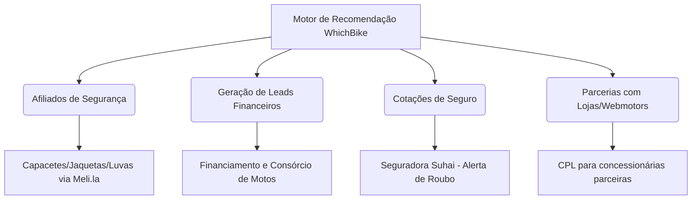

# Plano de Monetização | WhichBike 🏍️💰

Este documento detalha o plano estratégico de monetização para o portal **WhichBike**, aproveitando a estrutura de recomendação e o motor de decisão inteligente para o mercado brasileiro de motocicletas (novas e usadas).

---

## 📊 Pilares de Monetização

O modelo de negócios do WhichBike está dividido em 4 pilares principais, combinando receitas passivas de afiliados com captação de leads altamente qualificados para o mercado financeiro e concessionárias.



---

## 1. Curadoria de Afiliados (Baixo Esforço, Alta Conversão)
Aproveitando a página **[Qual Equipamento Usar? (Which Gear)](file:///home/danilo/Projects/whichbike/website/which-gear.html)**, monetizamos o direcionamento de tráfego para compras de vestuário e proteção de pilotos.

*   **Mercado Livre Affiliates (`meli.la`):** Integração de links curtos de afiliados para os itens curados no banco de dados ([`gear.yml`](file:///home/danilo/Projects/whichbike/website/_data/gear.yml)). 
    *   *Padrão de Qualidade:* Utilização exclusiva de anúncios de **Lojas Oficiais** (ex: LS2 Oficial, Alpinestars Oficial) ou vendedores com reputação **MercadoLíder Platinum** para evitar devoluções e reclamações de usuários.
*   **Kits de Manutenção para Motos Usadas:** Ao sugerir uma moto usada (ex: Honda Hornet 2012 ou Suzuki Bandit 2012), o card de resultado pode oferecer um link direto para "Kit de Revisão Recomendado (Óleo Motul + Filtros)" no Mercado Livre, gerando comissões sobre itens de alto giro.

---

## 2. Geração de Leads Financeiros (Consórcio e Financiamento)
A maior parte das motocicletas no Brasil é adquirida por meio de financiamento ou consórcio. O WhichBike captura a intenção real de compra no momento em que o usuário encontra a "moto perfeita".

*   **Widget de Simulação de Financiamento:** Nos resultados do quiz, integramos um botão de chamada para ação (CTA): *"Simular Financiamento para este Modelo"*.
*   **Parcerias Bancárias (CPA/CPL):** Integração com APIs de crédito de instituições como Santander (líder em financiamento de motos), BV Financeira ou Porto Seguro Consórcio. Cada simulação qualificada (CPF verificado) gera um repasse de comissão por lead (CPL).
*   **Consórcio Integrado:** Para usuários que buscam planejamento de médio prazo (ex: quem selecionou orçamento acima do disponível imediato), oferecemos a opção de consórcio como forma de compra inteligente.

---

## 3. Cotação de Seguros Integrada (Suhai e Porto Seguro)
O algoritmo do WhichBike já calcula o risco de roubo (`theft_risk_index`) com base na localidade (Capitais vs Interior). Aproveitaremos esse momento de alerta para oferecer a solução.

*   **Gatilho de Risco de Roubo:** Quando o resultado exibe um alerta de "Risco Crítico de Roubo" (ex: Honda Hornet, Yamaha XT 660R), ativamos o CTA: *"Cotar Seguro Anti-Roubo para esta Moto"*.
*   **Suhai Seguradora:** Parceria preferencial com a Suhai (líder em aceitação de motos de alta cilindrada/usadas com perfil de roubo crítico no Brasil).
*   **Comissão sobre Apólice:** Integração com corretoras online parceiras (como Minuto Seguros ou Bidu) recebendo uma comissão sobre cada apólice emitida que teve origem no WhichBike.

---

## 4. Integração com Marketplaces de Classificados (CPL / Parcerias)
Direcionamento do fluxo de usuários decididos para a compra real de motocicletas seminovas ou zero km.

*   **Encontrar no Webmotors / OLX / Icarros:** Links dinâmicos parametrizados nos cards de resultados. Exemplo: ao recomendar uma "Yamaha Lander 250 (2026)", gerar um link dinâmico de pesquisa:
    ```
    https://www.webmotors.com.br/motos/estoque/yamaha/lander-250?ano-modelo=2026
    ```
*   **CPL de Concessionárias Locais:** Lojas de motos usadas locais podem pagar mensalidades ou taxas por lead para receber contatos de usuários do WhichBike que residem em sua área de atuação (calculado via filtro de localidade do quiz) e procuram exatamente os modelos em seu estoque.

---

## 📋 Próximos Passos para Implementação

1.  **Cadastro nos Programas:** Efetuar cadastro no programa de afiliados do Mercado Livre (portal de criadores) para obter o ID de afiliado e gerar links curtos com o prefixo `meli.la`.
2.  **Validador de Links de Afiliados:** Utilizar o script de auditoria do WhichBike para certificar-se de que os anúncios no Mercado Livre não estão pausados ou sem estoque.
3.  **Implementação de CTAs no Matcher:** Adicionar os botões secundários nos cards de resultados do quiz:
    *   *Botão Principal:* Ver Equipamentos Recomendados (direciona para `/which-gear`).
    *   *Botão Secundário 1:* Simular Parcelas (Financiamento).
    *   *Botão Secundário 2:* Cotar Seguro (especialmente ativo se `theft_risk_index` for High ou Critical).
